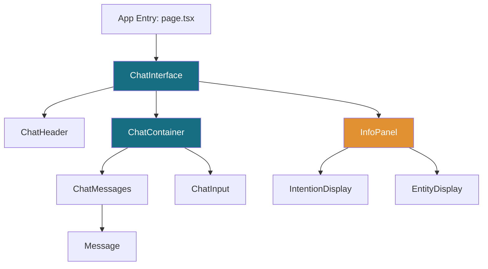
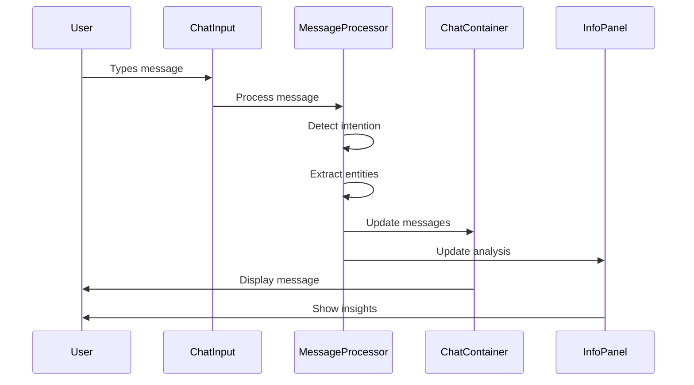
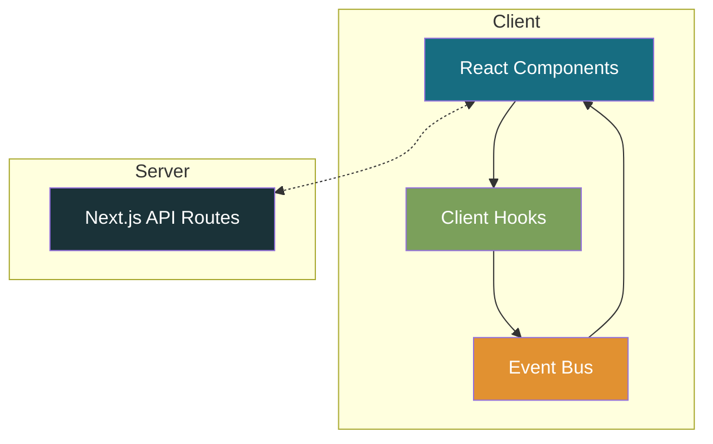

# Attune Architecture

## Component Structure

```mermaid
graph TD
    A[App Entry: page.tsx] --> B[ChatInterface]
    B --> C[ChatHeader]
    B --> D[ChatContainer]
    B --> E[InfoPanel]
    D --> F[ChatMessages]
    D --> G[ChatInput]
    F --> H[Message]
    E --> I[IntentionDisplay]
    E --> J[EntityDisplay]
    
    style B fill:#176D81,color:white
    style D fill:#176D81,color:white
    style E fill:#E19131,color:white
```

## Data Flow

```mermaid
sequenceDiagram
    participant User
    participant ChatInput
    participant MessageProcessor
    participant ChatContainer
    participant InfoPanel
    
    User->>ChatInput: Types message
    ChatInput->>MessageProcessor: Process message
    MessageProcessor->>MessageProcessor: Detect intention
    MessageProcessor->>MessageProcessor: Extract entities
    MessageProcessor->>ChatContainer: Update messages
    MessageProcessor->>InfoPanel: Update analysis
    ChatContainer->>User: Display message
    InfoPanel->>User: Show insights
```

## Client/Server Architecture

```mermaid
flowchart TD
    subgraph Client
        A[React Components] --> B[Client Hooks]
        B --> C[Event Bus]
        C --> A
    end
    
    subgraph Server
        D[Next.js API Routes]
    end
    
    A <-.-> D
    
    style A fill:#176D81,color:white
    style B fill:#7BA05B,color:white
    style C fill:#E19131,color:white
    style D fill:#1A3238,color:white
```
